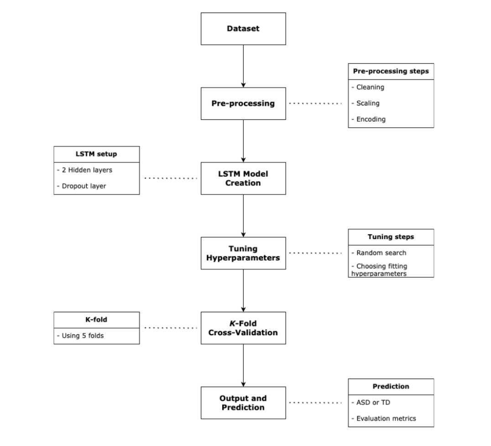
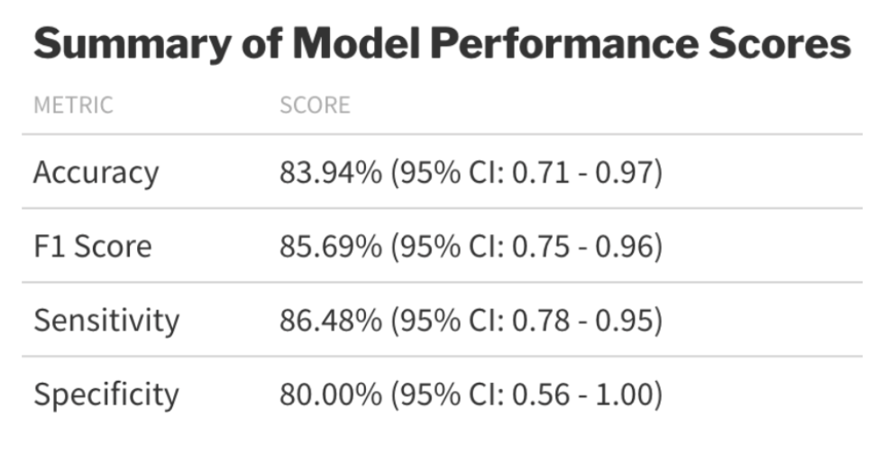
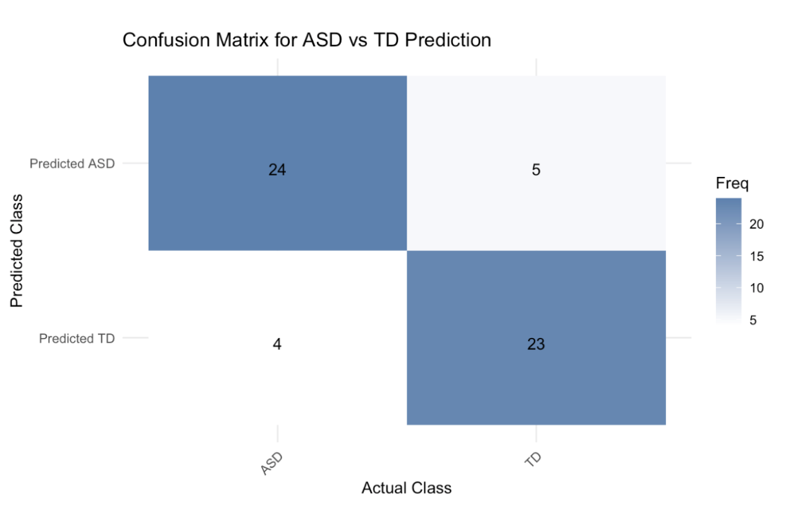
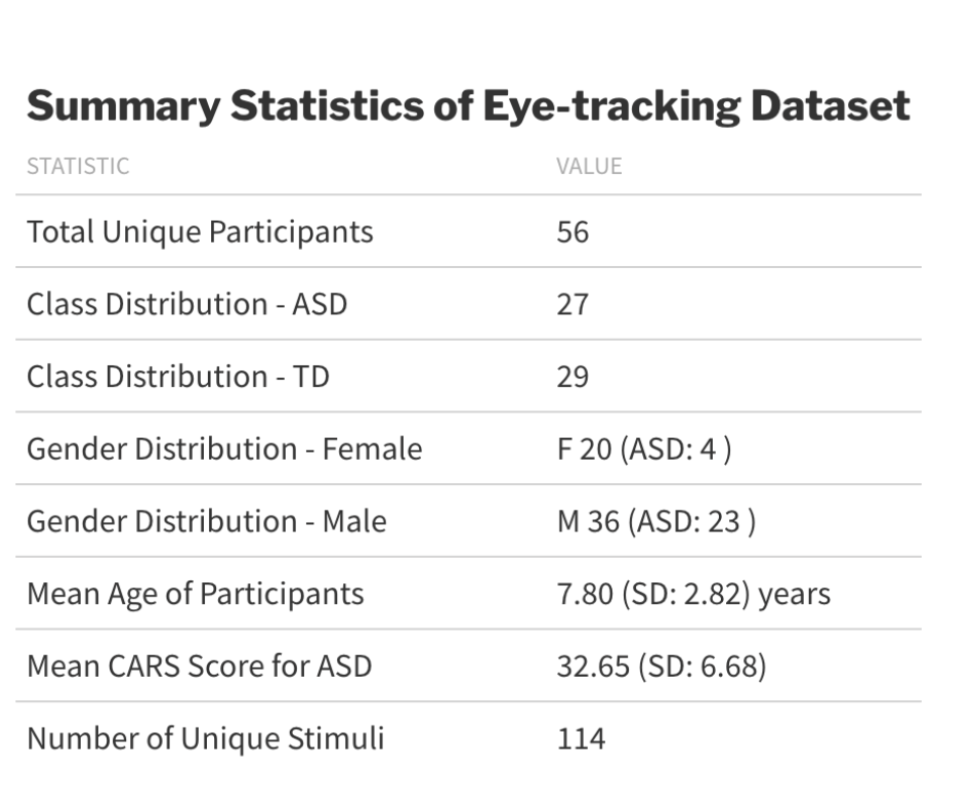
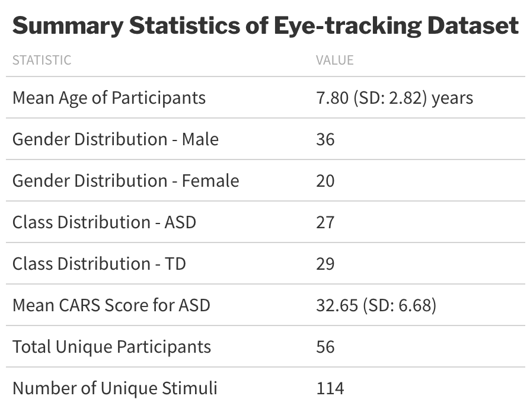

# Eyes on Autism: Utilizing Deep Learning Techniques for Classifying Autism Spectrum Disorder Through Eye Gaze and Pupil Responses

## Overview

This project explores the potential of using eye-tracking data combined with Long Short-Term Memory (LSTM) neural networks to classify Autism Spectrum Disorder (ASD). By analyzing gaze and pupil response patterns, we aim to develop an efficient and accurate tool for early ASD diagnosis.

**Authors**:  
- Søren Søndergaard Meiner (SM)
- Thorkild Kappel (TK)

**Institution**:  
School of Communication and Culture, Aarhus University  

---

## Background

Diagnosing ASD currently involves significant time and resources. This project leverages sequential eye-tracking data and deep learning to improve diagnostic efficiency. Unlike previous convolutional neural network (CNN) approaches, this study incorporates temporal dynamics using an LSTM model.

---

## Repository Structure

- **`data_inspection.ipynb`**: Notebook for data exploration and descriptive analysis.
- **`preprocess.ipynb`**: Notebook detailing the preprocessing pipeline.
- **`lstm.ipynb`**: LSTM model implementation and training.
- **`models/`**: Directory containing saved trained models.
- **`plots/`**: Contains visualizations used in the paper and this README.

---

## Methodology

### Data Preprocessing
- **Data Cleaning**: Missing values were imputed or removed.
- **Scaling**: Gaze coordinates and pupil sizes were normalized.
- **Encoding**: Categorical variables were one-hot encoded.
- **Sequencing**: Data was split into 2.4-second sequences for LSTM input.

### Model Development
- **Architecture**: Two hidden layers with dropout for regularization.
- **Training**: Cross-validated using a 5-fold approach.
- **Hyperparameter Tuning**: Random search for optimal parameters.

---

## Results

### Performance Metrics
The model achieved the following metrics during 5-fold cross-validation:

### Confusion Matrix
The confusion matrix provides a visualization of the classification results, highlighting true positives, false positives, true negatives, and false negatives.

---

## Discussion

### Implications
The findings demonstrate the potential of eye-tracking combined with deep learning for ASD screening. This method could reduce diagnosis time and costs, making it accessible for broader use.

### Limitations
- Limited dataset size and diversity.
- Lack of direct control over data collection.
- Difficulty interpreting neural network "black box" decisions.

### Future Work
- Expanding the dataset to include diverse populations.
- Integrating other modalities (e.g., EEG) for multimodal analysis.
- Exploring transformer-based models for enhanced temporal feature capture.

---

## Figures and Tables

### Summary Statistics
The dataset includes 56 participants (27 ASD, 29 TD). 

### Descriptive Table
Key statistics of the preprocessed dataset are summarized below.

